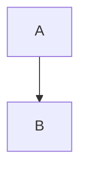

# Hello_World Heading

> [!NOTE]
> a note

- [x] done
- [ ] todo

:+1:

Inline $a^2$ math.



```go
package main
```

Footnote[^1].

[^1]: the note

<details><summary>More</summary>

hidden

</details>

See #46.

$$
\sum_{k=1}^n k
$$

| a | b |
|---|---|
| 1 | 2 |
